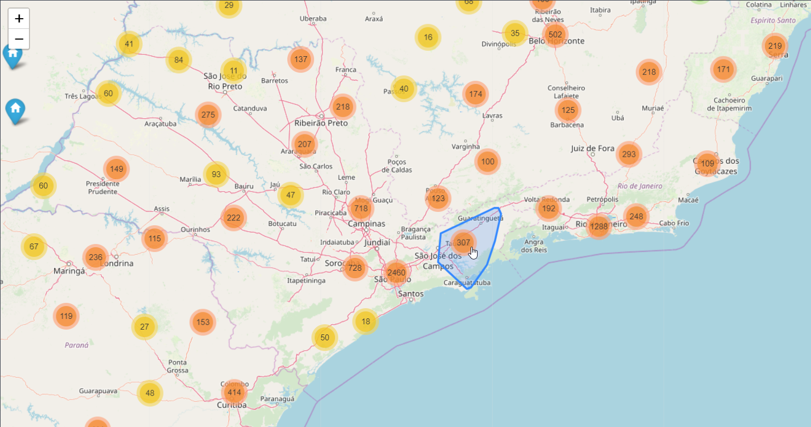
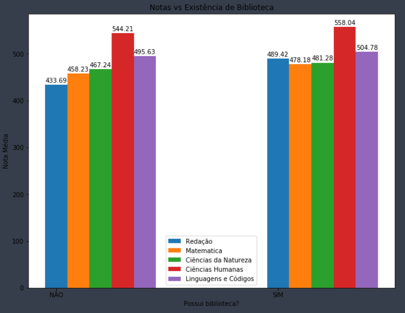
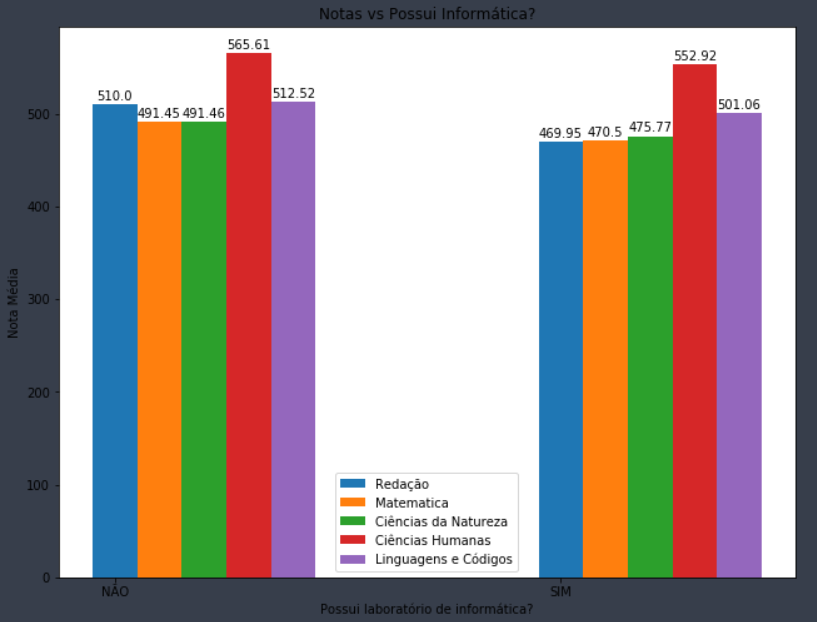

# Enem  X Educação Básica
Projeto de Data Scientist focado em analises atráves dos microdados disponibilizados pelo INEP. O objetivo é mapear e entender como a infraestrutura da escola durante a educação básica interfere nos resultados colhidos no ENEM. O principal foco de estudo é compreender se escolas de educação primária que possuem agua filtrada, internet, etc. apresentam melhores resultados no enem, a correlação das bases será feita pelo código identificador de escola.

# Links de Acesso as Bases
Bases utilizadas para o estudo:

[Microdados Educação Básica](http://download.inep.gov.br/microdados/microdados_educacao_basica_2018.zip)

[Microdados Enem](http://download.inep.gov.br/microdados/microdados_enem2018.zip)

[Dados de Estados e Região](http://download.inep.gov.br/microdados/micro_censo_escolar_2014.zip)

  
# Recomendações para o uso:
  1 - Instale as bibliotecas colocadas no arquivo requirements.txt (pip install -r requirements.txt)

  2 - Baixe as bases de dados especificadas acima.

  3 - Salve as bases recem baixadas num diretorio BASES/DADOS/ na mesma pasta que o arquivo .ipynb

  4 - Execute jupyter notebook no seu CMD e navegue pela arvore até encontrar o Estudo Enem x Educação Básica.ipynb

  5 - Use nosso notebook sem moderação! :)

# Resultados Colhidos

## Frequência de Registros por Região

    
    

## Comparativo de Média de Notas do Enem vs Existência da Biblioteca na Escola

    
    

## Comparativo de Média de Notas do Enem vs Existência da Laboratóriode Informática na Escola

    
    

